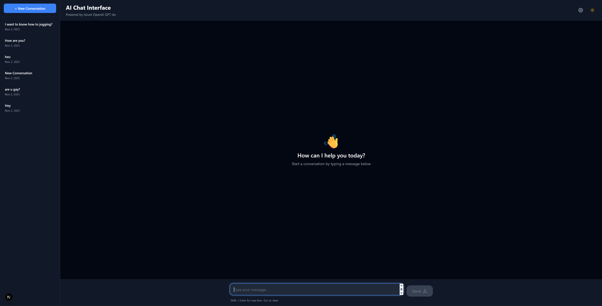
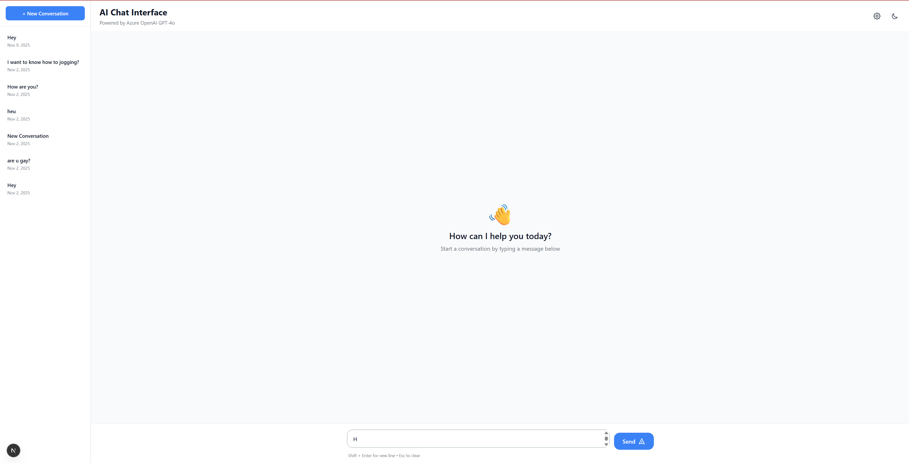

# AI Chat Interface

Modern chat interface application built with Next.js 15, TypeScript, and Azure OpenAI GPT-4o with advanced UX features.

## Screenshots

### Dark Mode


### Light Mode


## Features

- 🤖 **Real-time AI Chat** powered by Azure OpenAI GPT-4o
- 💬 **Markdown Rendering** with headers, bold text, lists, code blocks, and links
- 💾 **localStorage Storage** - Fast, client-side conversation persistence
- 📚 **Conversation History** - Sidebar with all your chat sessions
- 🎨 **Dark/Light Theme** toggle with high-contrast WCAG AAA design
- ⚡ **Modern UX Features**:
  - Typing indicator with animated dots
  - Copy messages to clipboard
  - Regenerate AI responses
  - Scroll-to-bottom button
  - Smooth message animations
  - Auto-focus input field
  - Keyboard shortcuts (Enter to send, Shift+Enter for new line, Esc to clear)
  - Character limit with counter (4000 chars)
- 📱 **Responsive Design** optimized for all screen sizes

## Tech Stack

- **Frontend**: Next.js 15 (App Router), React 18, TypeScript 5.6
- **Styling**: Tailwind CSS 3.4 with custom animations
- **AI/LLM**: Azure OpenAI GPT-4o API
- **Storage**: Browser localStorage for conversation persistence
- **Markdown**: react-markdown with remark-gfm
- **State Management**: React Hooks

## Getting Started

### Prerequisites

- Node.js 20+ and npm
- Azure OpenAI account with API key and deployment

### Installation

1. Clone the repository and navigate to the project directory:

```bash
cd chat-interface
```

2. Install dependencies:

```bash
npm install
```

3. Set up environment variables:

```bash
cp .env.local.example .env.local
```

Edit `.env.local` with your actual credentials.

4. Run the development server:

```bash
npm run dev
```

5. Open [http://localhost:3000](http://localhost:3000) in your browser.

## Project Structure

```
chat-interface/
├── app/                    # Next.js App Router
│   ├── api/               # API routes
│   ├── layout.tsx         # Root layout
│   ├── page.tsx           # Main page
│   └── globals.css        # Global styles
├── components/            # React components
│   ├── chat/             # Chat components
│   ├── sidebar/          # Sidebar components
│   ├── providers/        # Context providers
│   └── ui/               # UI components
├── lib/                   # Utilities and configs
│   ├── supabase/         # Supabase client
│   ├── azure-openai/     # Azure OpenAI client
│   ├── pydantic-ai/      # PydanticAI agents
│   └── utils/            # Helper functions
├── types/                 # TypeScript types
└── public/               # Static assets
```

## Scripts

- `npm run dev` - Start development server
- `npm run build` - Build for production
- `npm run start` - Start production server
- `npm run lint` - Run ESLint
- `npm run type-check` - Run TypeScript compiler check

## License

MIT
